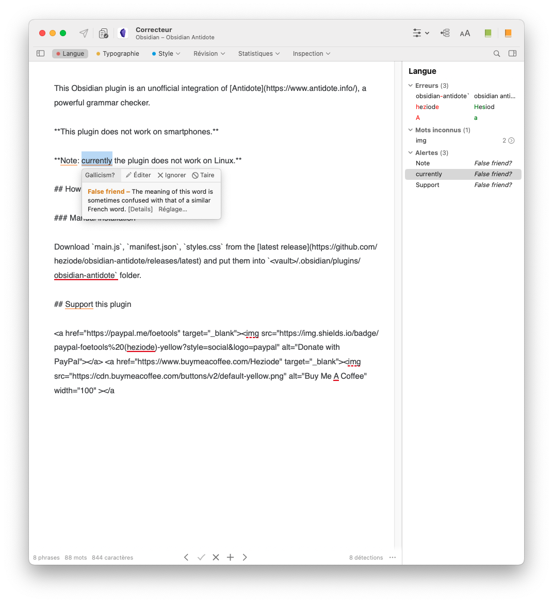
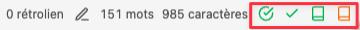

# Antidote Grammar Checker Integration

This Obsidian plugin is an unofficial integration of [Antidote](https://www.antidote.info/), a powerful grammar checker.

Antidote supports these languages:

- English
- French

This plugin works with Antidote 10 (using Connectix version 11 or higher) and higher, and Antidote web, on macOS, Linux and Windows.

**This plugin does not work on smartphones.**

## How to install

### Manual installation

Download `main.js`, `manifest.json`, `styles.css` from the [latest release](https://github.com/heziode/obsidian-antidote/releases/latest) and put them into `<vault>/.obsidian/plugins/antidote-grammar-checker-integration` folder.

## How to use

This plugin adds 3 icons into the status bar:

- The check corresponding to the Antidote corrector
- The green book corresponding to the Antidote dictionary
- The orange book corresponding to the Antidote guide

You can show or hide every icon from settings.

It also adds command for corrector, dictionary and guide.

### Additional note for Linux users

Antidote 10 is the latest supported version of Antidote on this OS. Accordingly, the Connectix version 10 installed with this version is not supported.

In order to use Antidote 10 (or web) with this plugin, you will have to install the latest Connectix (version 11 or higher). Connectix is the bridge between Obsidian and Antidote (10, 11+, web), so by keeping Antidote 10 with Connectix 11, you will be able to use this plugin.

## Support this plugin

