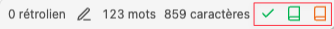

# obsidian-antidote

This Obsidian plugin is an unofficial integration of [Antidote](https://www.antidote.info/), a powerful grammar checker.

Antidote support these languages:

- English
- French

**This plugin does not work on smartphones.**

**Note: currently the plugin does not work on Linux.**

## How to install

### Manual installation

Download `main.js`, `manifest.json`, `styles.css` from the [latest release](https://github.com/heziode/obsidian-antidote/releases/latest) and put them into `<vault>/.obsidian/plugins/obsidian-antidote` folder.

## How to use

This plugin add 3 icons into the sidebar:

- The check corresponding to the Antidote corrector
- The green book corresponding to the Antidote dictionary
- The orange book corresponding to the Antidote guide

You can show or hide Dictionary and Guide from settings.

## Support this plugin

