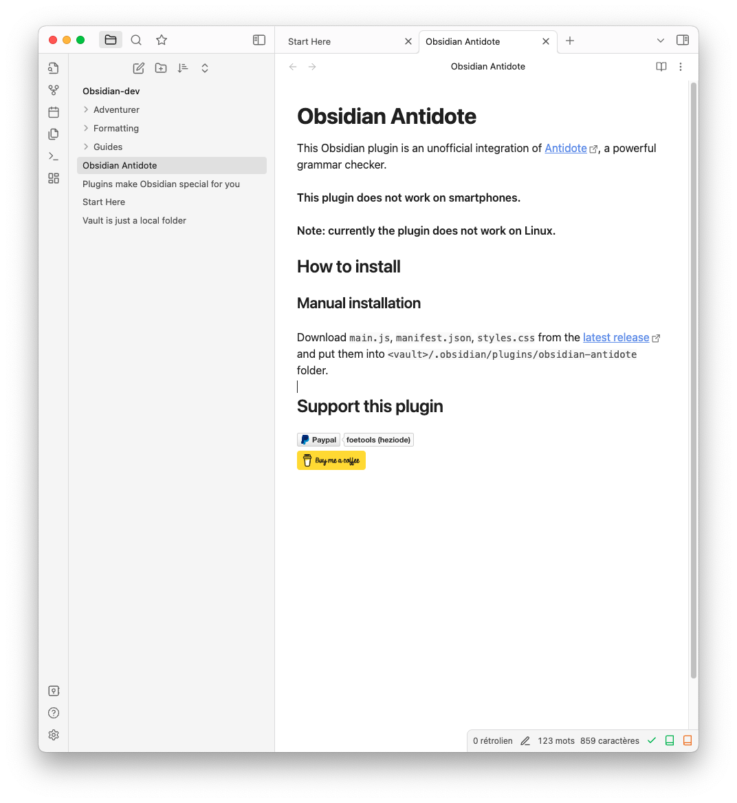
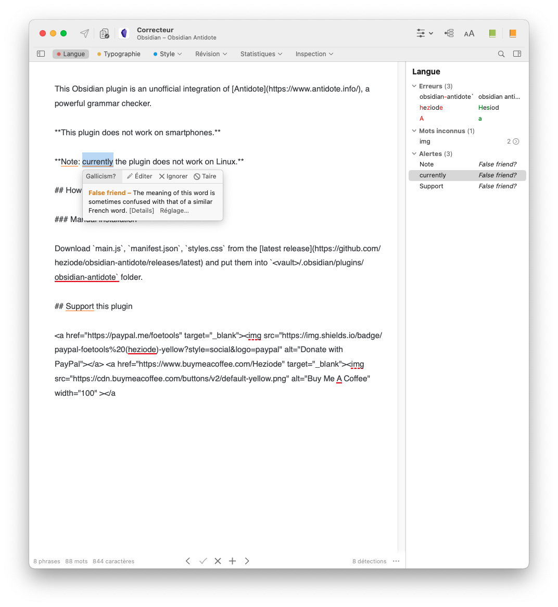
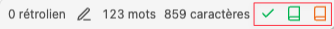

# Antidote Grammar Checker Integration

This Obsidian plugin is an unofficial integration of [Antidote](https://www.antidote.info/), a powerful grammar checker.

Antidote supports these languages:

- English
- French

This plugin works with Antidote 10 (using Connectix version 11 or higher) and higher, and Antidote web, on macOS (11 and higher), Linux and Windows.

**This plugin does not work on smartphones.**

## Requirements

Antidote is a separate application, sold by [Druide](https://www.druide.com/). This plugin is only a bridge between Obsidian and Antidote: it corrects nothing by itself, and it cannot install anything for you. You need, on the same computer as Obsidian:

- A license for Antidote 10 or higher, or Antidote Web ([first purchase](https://www.antidote.info/en/store/first-purchase))
- Antidote installed
- The Connectix agent, in version 11 or higher. Connectix is what links Antidote to its integrations (Word, VS Code, your browser, Obsidian, etc.), and it is normally installed along with Antidote

If Antidote already works in another application but not in Obsidian, your Connectix is most likely too old: see [Installing Connectix 11 with Antidote 10](#installing-connectix-11-with-antidote-10).

## How to install

### From Obsidian

This plugin can be found in Obsidian's community plugins library, `Settings > Community Plugins > Browse`: [antidote-grammar-checker-integration](https://obsidian.md/plugins?id=antidote-grammar-checker-integration)

### Manual installation

Download `main.js`, `manifest.json`, `styles.css` from the [latest release](https://github.com/heziode/obsidian-antidote/releases/latest) and put them into `<vault>/.obsidian/plugins/antidote-grammar-checker-integration` folder.

### Installing Connectix 11 with Antidote 10

Antidote 10 ships with Connectix 10, which this plugin does not support. Keeping Antidote 10 is fine, but Connectix has to be upgraded to version 11 or higher: it is the bridge between Obsidian and Antidote (10, 11+, web), and the two versions do not have to match.

Connectix 11 can be downloaded from your [Client Portal](https://services.druide.com/client/), under the "Useful links" section: "Connectix Utility for Antidote Web".

Its installer may refuse to run while Antidote 10 is still installed:

- **Windows**: the installer offers to either install or decompress. Choose to decompress, then run the `.msi` file it extracted ([reported by @GittyBob](https://github.com/Heziode/obsidian-antidote/issues/15))
- **macOS**: no workaround is known yet. If you find one, please say so in [issue #14](https://github.com/Heziode/obsidian-antidote/issues/14)

On Linux, Antidote 10 is the latest supported version of Antidote, so this upgrade is the only way to use the plugin on that system.

## How to use

This plugin adds 4 icons into the status bar:

- The check within a circle corresponding to the Antidote corrector, that will check the whole document
- The check corresponding to the Antidote corrector
- The green book corresponding to the Antidote dictionary
- The orange book corresponding to the Antidote guide

You can show or hide every icon from settings.

It also adds command for corrector, dictionary and guide.

### Behavior of "Correct All" and "Corrector"

The "Correct All" send the whole document to Antidote, or, the selection, whereas the "simple correct" send the text depending the position of the cursor and the selection. The "simple correct" has the same behavior as the official integrations in other software (VS Code, Word, etc.).

## Troubleshooting

**"Antidote was not found."** Neither Antidote nor its Connectix agent could be located on this computer. Check the [requirements](#requirements): both are separate applications that have to be installed on their own.

**"Unable to communicate with Connectix Agent (Antidote)."** Antidote is installed, but the plugin could not talk to it. In order:

- Check that Antidote works from another application, your browser for instance. If it does not, the problem is in Antidote rather than in this plugin
- Check that Connectix is in version 11 or higher, otherwise [upgrade it](#installing-connectix-11-with-antidote-10)
- Restart Obsidian, and if that is not enough, your computer. Connectix sometimes stops answering until it is restarted

The developer console, `Ctrl+Shift+I` (`Cmd+Option+I` on macOS), shows the underlying error. Please include it when reporting an issue, along with your Antidote, Connectix, Obsidian and system versions.

## Support this plugin

